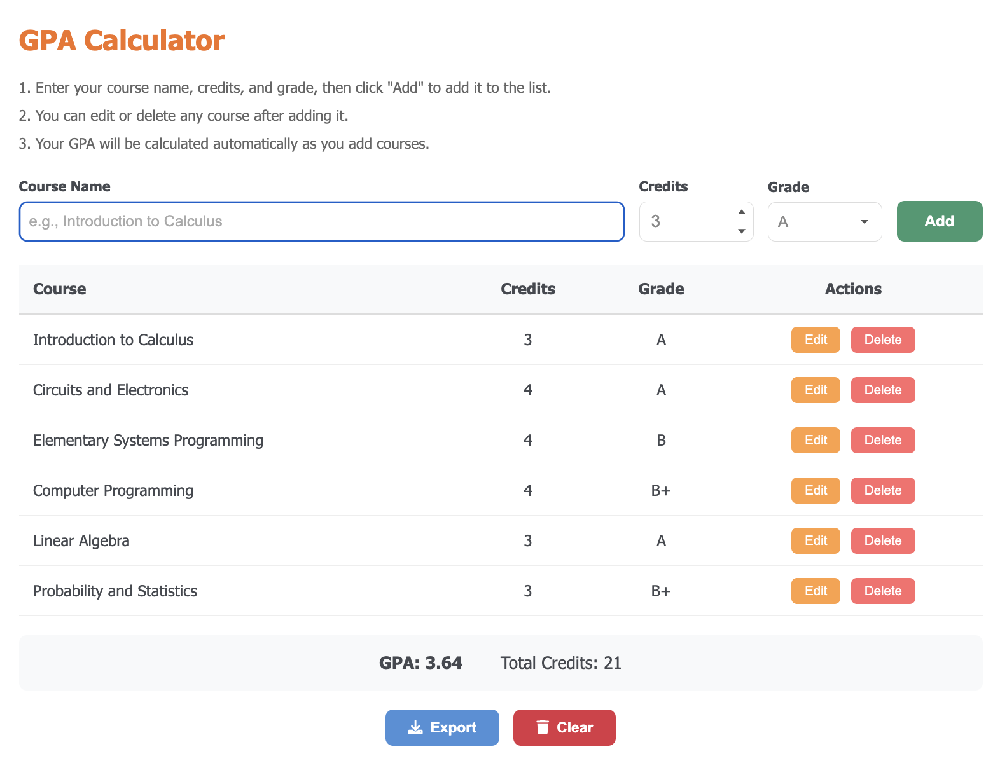
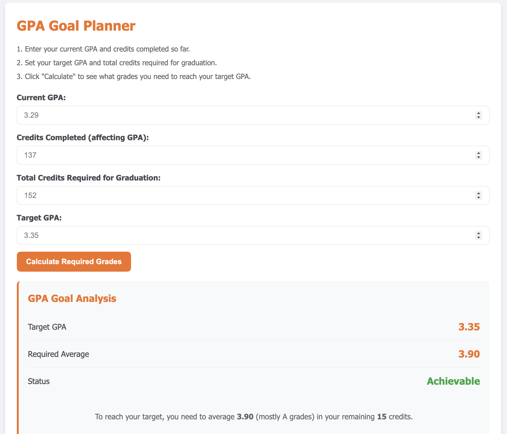
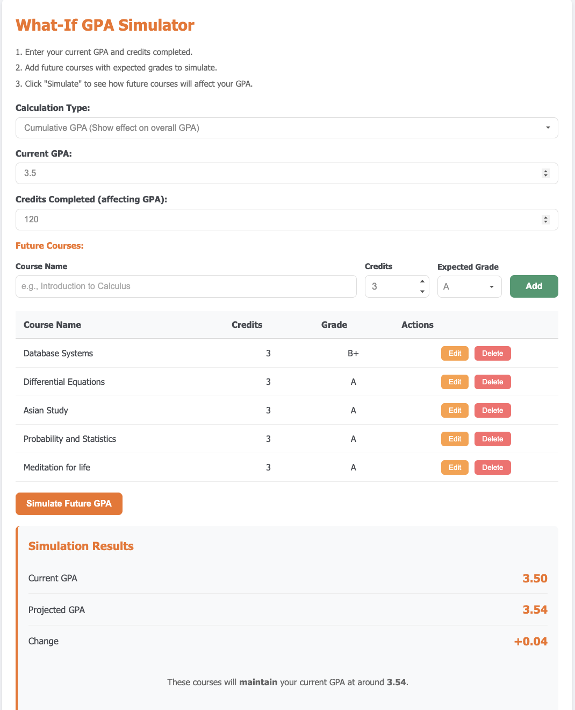
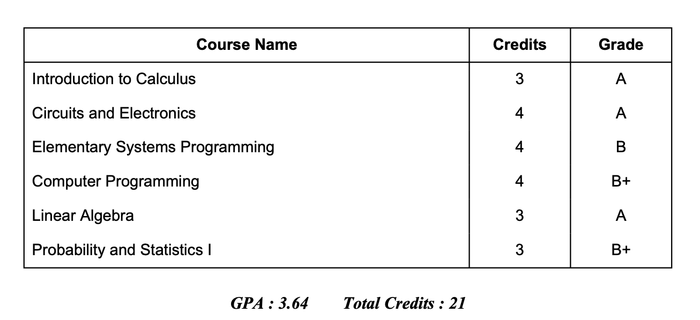
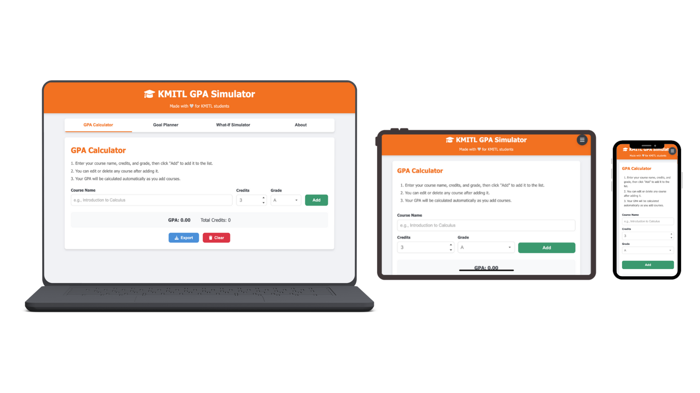
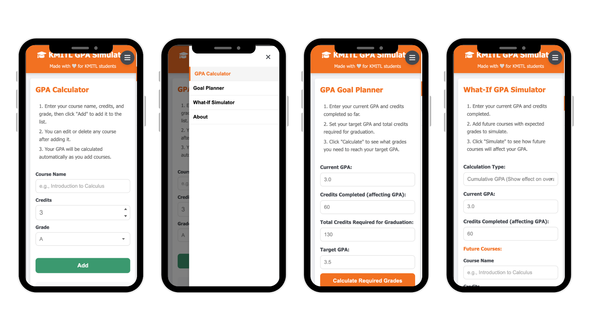

# KMITL GPA Simulator - User Manual

A simple guide to help you use KMITL GPA Simulator.

---

## Introduction

KMITL GPA Simulator helps you:

- **Calculate** your GPA from your courses
- **Plan** what grades you need to reach your goal
- **Test** how future grades will change your GPA
- **Export** your results as a PDF file

**Website**: [https://kmitl-gpa-simulator.pages.dev/](https://kmitl-gpa-simulator.pages.dev/)

---

## Getting Started

1. Open the website in your browser
2. You will see four tabs:
   - **GPA Calculator** - Find your current GPA
   - **Goal Planner** - Set your GPA goal
   - **What-If Simulator** - Test different grades
   - **About** - Learn about grading
3. Click any tab to use it

> **Note**: Your data is saved in your browser only. If you clear browser data or use another device, your courses will be lost.

---

## GPA Calculator

Use this to calculate your current GPA.

<figure align="center">
  
  <figcaption><em>Figure 1: GPA Calculator interface</em></figcaption>
</figure>

### Add a Course

1. Go to the **GPA Calculator** tab
2. Enter your course info:
   - **Course Name**: Type the course name (e.g., "Calculus I")
   - **Credits**: Pick the credits (1-4)
   - **Grade**: Pick your grade (A, B+, B, C+, C, D+, D, F)
3. Click **Add Course**
4. Your GPA updates right away

### Edit a Course

1. Find the course in the table
2. Click the **Edit** button (pencil icon)
3. Change the info
4. Click **Update Course**

### Delete a Course

1. Find the course in the table
2. Click the **Delete** button (trash icon)
3. The course is removed and GPA updates

### Clear All Courses

1. Click **Clear All**
2. All courses are removed
3. GPA goes back to 0.00

### Your Results

- **Current GPA**: Your GPA score (0.00 - 4.00)
- **Total Credits**: Sum of all credits

---

## Goal Planner

Use this to check if your desired GPA is feasible.

<figure align="center">
  
  <figcaption><em>Figure 2: Goal Planner interface</em></figcaption>
</figure>

### How to Use

1. Go to the **Goal Planner** tab
2. Enter your current info:
   - **Current GPA**: Your GPA now
   - **Credits Completed**: Credits you have finished
3. Enter your goal:
   - **Target GPA**: The GPA you want
   - **Total Credits**: Total credits needed to graduate
4. Click **Calculate**

### Your Results

- **Status**: Shows "Possible" or "Not Possible"
- **Required GPA**: The GPA you need in remaining courses
- **Grade Combinations**: Examples of grades that work

### Example

| Input | Value |
|-------|-------|
| Current GPA | 3.00 |
| Credits Done | 60 |
| Target GPA | 3.50 |
| Total Credits | 120 |

Result: You need **4.00** GPA in your next 60 credits.

---

## What-If Simulator

Use this to see how future grades change your GPA.

<figure align="center">
  
  <figcaption><em>Figure 3: What-If Simulator interface</em></figcaption>
</figure>

### Two Modes

1. **Term GPA**: See your semester GPA and how it affects total GPA
2. **Cumulative GPA**: See your new total GPA directly

### How to Use

1. Go to the **What-If Simulator** tab
2. Enter your current info:
   - **Current GPA**: Your GPA now
   - **Credits Completed**: Credits you have finished
3. Pick **Term** or **Cumulative** mode
4. Add courses you plan to take:
   - Pick the **Grade** you expect
   - Pick the **Credits**
   - Click **Add Course**
5. Click **Calculate**

### Your Results

**Term mode shows:**
- **Term GPA**: GPA for new courses only
- **New GPA**: Your updated total GPA
- **GPA Change**: How much your GPA changed

**Cumulative mode shows:**
- **Projected GPA**: Your new total GPA
- **GPA Change**: How much your GPA changed

### Tips

- Try different grades to see what happens
- Focus more on courses that affect your GPA most

---

## Exporting Your GPA Report

Save your GPA as a PDF file.

<figure align="center">
  
  <figcaption><em>Figure 4: PDF Export feature</em></figcaption>
</figure>

### How to Export

1. Go to **GPA Calculator** tab
2. Add all your courses
3. Click **Export as PDF**
4. The PDF downloads to your device

---

## Grading Scale 

### Letter Grades

| Grade | Points | Meaning |
|-------|--------|---------|
| A | 4.0 | Excellent |
| B+ | 3.5 | Very Good |
| B | 3.0 | Good |
| C+ | 2.5 | Fairly Good |
| C | 2.0 | Fair |
| D+ | 1.5 | Poor |
| D | 1.0 | Very Poor |
| F | 0.0 | Fail |

### Special Grades

| Grade | Meaning | Gets Credits? |
|-------|---------|---------------|
| I | Incomplete | No |
| S | Satisfactory | Yes |
| U | Unsatisfactory | No |
| T | Transfer | Yes |

### How GPA is Calculated

```
GPA = Total Points ÷ Total Credits
```

**Example:**
| Course | Grade | Credits | Points |
|--------|-------|---------|--------|
| Math | A | 3 | 4.0 × 3 = 12.0 |
| Physics | B+ | 3 | 3.5 × 3 = 10.5 |
| English | B | 2 | 3.0 × 2 = 6.0 |

**Total Points**: 12.0 + 10.5 + 6.0 = 28.5
**Total Credits**: 3 + 3 + 2 = 8
**GPA**: 28.5 ÷ 8 = **3.56**

---

## Mobile Usage

This app works on phones and tablets.

<figure align="center">
  
  <figcaption><em>Figure 5: Responsive design across devices (desktop, tablet, mobile)</em></figcaption>
</figure>

<figure align="center">
  
  <figcaption><em>Figure 6: Mobile interface with hamburger menu</em></figcaption>
</figure>

### Using on Mobile

1. Tap the **menu icon** (☰) at the top right
2. Pick the tab you want
3. Tap outside or press X to close the menu

---

## Need Help?

If you have problems or for further contribution:

- Contact the developer at phyoethikhine143@gmail.com

---

## Reference

- [KMITL Academic Regulations (ข้อบังคับสถาบันว่าด้วยการศึกษาระดับปริญญาตรี พ.ศ. 2565)](https://law.kmitl.ac.th/wp-content/uploads/2024/01/1.6-%E0%B8%82%E0%B9%89%E0%B8%AD%E0%B8%9A%E0%B8%B1%E0%B8%87%E0%B8%84%E0%B8%B1%E0%B8%9A%E0%B8%AA%E0%B8%96%E0%B8%B2%E0%B8%9A%E0%B8%B1%E0%B8%99-%E0%B8%A7%E0%B9%88%E0%B8%B2%E0%B8%94%E0%B9%89%E0%B8%A7%E0%B8%A2%E0%B8%81%E0%B8%B2%E0%B8%A3%E0%B8%A8%E0%B8%B6%E0%B8%81%E0%B8%A9%E0%B8%B2%E0%B8%A3%E0%B8%B0%E0%B8%94%E0%B8%B1%E0%B8%9A%E0%B8%9B%E0%B8%A3%E0%B8%B4%E0%B8%8D%E0%B8%8D%E0%B8%B2%E0%B8%95%E0%B8%A3%E0%B8%B5-%E0%B8%9E.%E0%B8%A8.-2565.pdf)

---

## Tech Stack

- **Frontend:** HTML, CSS, JavaScript
- **Backend:** Cloudflare Pages Functions
- **Hosting:** Cloudflare Pages

## Development

```bash
# Install wrangler CLI
npm install -g wrangler

# Run locally
wrangler pages dev public

# Deploy
wrangler pages deploy public
```

## Project Structure

```
├── public/              # Static files
│   ├── index.html
│   ├── styles.css
│   └── script.js
├── functions/           # Cloudflare Pages Functions (API)
│   └── api/
│       ├── gpa-goal-planner.js
│       └── what-if-simulator.js
└── wrangler.jsonc       # Cloudflare config
```

## Author

Developed by Phyo Thi Khaing
